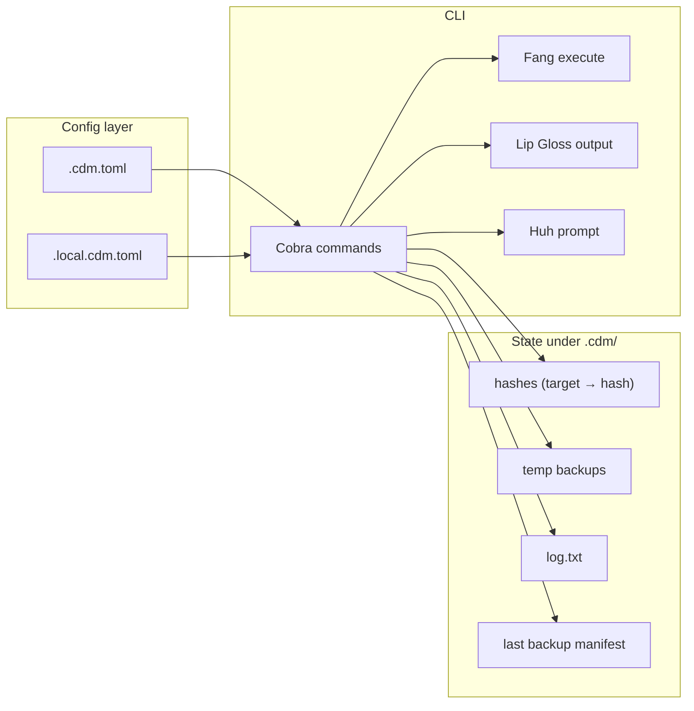

# cutest-dotfiles-manager (cdm) – Implementation Plan

## Current state

The repo contains only [LICENSE](LICENSE) (GPL-3.0). No Go code, no `go.mod`, no config. Implementation starts from scratch.

## Architecture overview



- **Config**: `.cdm.toml` (committed) + `.local.cdm.toml` (gitignored) for variable values.
- **State**: `.cdm/` holds hashes, temp backups, `log.txt`, and a "last apply backup" manifest for undo.
- **CLI**: Cobra for subcommands and flags; Fang for running the app (styled help + `completion`); Lip Gloss for all printed output; Huh only for the "traverse up or stop?" prompt when no config is found.

## Tech choices

| Concern                   | Choice                                                                                     | Rationale                                                                             |
| ------------------------- | ------------------------------------------------------------------------------------------ | ------------------------------------------------------------------------------------- |
| Commands & flags          | [spf13/cobra](https://github.com/spf13/cobra)                                              | Standard Go CLI; works with Fang and completion.                                      |
| Styled help & completion  | [charmbracelet/fang](https://github.com/charmbracelet/fang)                                | Charm's Cobra wrapper: fancy help, errors, and built-in `completion` (bash/zsh/fish). |
| Pretty output             | [charmbracelet/lipgloss](https://github.com/charmbracelet/lipgloss)                        | Style success/error, diffs, status tables, warnings.                                  |
| Single interactive prompt | [charmbracelet/huh](https://github.com/charmbracelet/huh)                                  | "Traverse up to find .cdm.toml?" confirm when no config in cwd.                       |
| TOML                      | [BurntSushi/toml](https://github.com/BurntSushi/toml) or stdlib `encoding/toml` (Go 1.23+) | Parse `.cdm.toml` and `.local.cdm.toml`.                                              |
| File watching             | [fsnotify/fsnotify](https://github.com/fsnotify/fsnotify)                                  | Cross-platform; used for `cdm watch`.                                                 |
| Diffs                     | [pmezard/go-diff](https://github.com/pmezard/go-diff) or similar                           | For `cdm diff` source vs target.                                                     |

**Note on "Charm libraries" and shell completion**: Bubble Tea and Bubbles are for full TUI apps. For a "pretty CLI" that prints styled text and has one yes/no prompt, Cobra + Fang + Lip Gloss + Huh is sufficient. Shell tab completion comes from **Cobra's completion** (exposed via Fang's `completion` command), not from Bubble Tea. Optional later: use Bubbles viewport for long `diff`/`status` output.

---

## 1. Project layout

```
cutest-dotfiles-manager/
├── cmd/
│   └── cdm/
│       └── main.go              # root command, fang.Execute(rootCmd)
├── internal/
│   ├── config/
│   │   ├── config.go            # load/parse .cdm.toml + .local.cdm.toml
│   │   ├── mappings.go           # merge default + OS-specific mappings, resolve vars
│   │   └── scripts.go           # pre_apply / post_apply script paths
│   ├── state/
│   │   ├── hashes.go            # read/write .cdm/hashes (target → content hash)
│   │   ├── log.go               # append to .cdm/log.txt
│   │   └── backup.go            # temp backups + last-backup manifest for undo
│   ├── apply/
│   │   └── apply.go             # apply logic: scripts, copy, hash, backup, log
│   ├── diff/
│   │   └── diff.go              # compute and format diff per mapping
│   ├── status/
│   │   └── status.go            # list mappings where source changed since last apply
│   ├── watch/
│   │   └── watch.go             # fsnotify on source files, debounced apply
│   └── ui/
│       ├── output.go            # Lip Gloss styles and print helpers
│       └── prompt.go            # Huh "traverse or stop?" when no .cdm.toml
├── go.mod
├── go.sum
└── README.md
```

No separate "add" or "init" package needed: they can live as command logic that calls `config` and `state` and filesystem helpers.

---

## 2. Config model (`.cdm.toml` and `.local.cdm.toml`)

**`.cdm.toml`** (committed):

- **Variables** (optional): `variables = ["HOME", "XDG_CONFIG_HOME"]`. Used for substitution in destination paths (e.g. `$HOME/.bashrc`).
- **Mappings**:
  - Default: `[mappings]` table, e.g. `".bashrc" = "$HOME/.bashrc"`. Keys = source path relative to repo root; values = destination path (with optional `$VAR`).
  - OS-specific: `[mappings.windows]`, `[mappings.macos]`, `[mappings.linux]` (same shape). At runtime, merge default + current OS table (e.g. `runtime.GOOS` → `windows` / `darwin` / `linux`).
- **Scripts**: `[scripts]` with `pre_apply = [".scripts/do_things.sh"]` and `post_apply = [".scripts/do_other_things.sh"]`. Paths relative to repo root.

**`.local.cdm.toml`** (gitignored):

- Key-value for variable values, e.g. `HOME = "/Users/me"`. Resolution order: `.local.cdm.toml` first, then `os.Getenv(var)`.

**Variable resolution and warnings**:

- Before any command that uses mappings: resolve all variables. If a variable is missing (not in `.local.cdm.toml` and not in env), skip mappings that use it and print a **large, visible Lip Gloss warning** listing missing variables and affected mappings.

---

## 3. State under `.cdm/`

- **Hashes file** (e.g. `.cdm/hashes.toml` or `.cdm/state.toml`): map `target_path → content_hash` (e.g. SHA256 of file content). Updated after each successful apply per mapping.
- **Temp backups**: on apply, when target exists and its current hash differs from stored hash, copy target to `.cdm/temp/{basename}_{date}.{ext}` (date format fixed, e.g. `20060102_150405`), then overwrite target. Append to `log.txt` and record in "last backup manifest".
- **Last backup manifest**: e.g. `.cdm/last_backup.toml` or `.cdm/last_backup.txt` listing, for the latest apply only, `temp_file → target_path`. Used by `undo-conflict-apply` to restore only those targets from `.cdm/temp/`.
- **Log**: `.cdm/log.txt` – append one line per notable action, e.g. `$datetime ran cdm apply: [$source -> $target]`, plus script runs, backups, errors (as specified).

All paths in state should be normalized (e.g. absolute or consistently relative) so Windows/Unix behave predictably.

---

## 4. Finding config (no `.cdm.toml` in cwd)

- If not found in current directory: use **Huh** `Confirm`: "No .cdm.toml here. Traverse up to find one (up to 5 levels) or exit?".
- If user confirms: walk parent directories (up to 5 levels); use first directory that contains `.cdm.toml` as **repo root** for that run.
- If not found or user declines: exit without running the requested command.

---

## 5. Commands (Cobra + Fang)

- **Root**: `cdm` – no default action; `-h` / `--help` / `help` print list of commands and short usage (Fang styles this).
- **`cdm help`** / **`cdm -h`** / **`cdm --help`**: Same as root help (Cobra/Fang handle `-h`/`--help`; add explicit `help` subcommand if desired).
- **`cdm init`**: Create `.cdm/` dir, empty or minimal `.cdm.toml` if missing, ensure `.gitignore` exists and contains `.cdm/` and `.local.cdm.toml`.
- **`cdm init <repo>`**: Clone `repo` (e.g. `git clone <repo> .` in a temp dir or current dir), `cd` into cloned dir, then run same steps as `cdm init`.
- **`cdm add <path> [target-path]`**: Copy file from `path` into repo (current dir or repo root): destination = `target-path` if given, else basename. Add mapping: source = relative path in repo → destination = `target-path` or `$HOME/.<basename>` (or similar default). Use **relative paths** for source in `.cdm.toml`.
- **`cdm apply`** (flags: `-d` / `--dry-run` for dry-run):
  - **Dry-run**: Resolve config and mappings; for each mapping only print what would be done; no writes. No pre_apply/post_apply. Show "dry run" banner.
  - **Normal**: Resolve config (variables, OS-specific mappings); warn and skip mappings with missing variables. Run `pre_apply` scripts; log and warn if script missing or execution fails. For each mapping: resolve target path; create parent dirs if target path doesn't exist (log warning per created path). If target exists: compare current content hash to stored hash; if different, backup to `.cdm/temp/...`, log and warn. Then copy source → target; update hash; log. On permission or missing-source errors, collect them and do not overwrite that target; continue other mappings. Run `post_apply` scripts; same warning/log on missing or failed script. At end: if any errors occurred, print a **readable Lip Gloss summary** (e.g. table or list: file, error type).
- **`cdm diff`**: For each mapping, show diff between source file and target file (after variable resolution). Use a diff library and format with Lip Gloss (e.g. red/green or unified style).
- **`cdm status`**: For each mapping, compare current **source** content hash to **stored hash** for the corresponding target. List mappings where they differ ("source edited since last apply").
- **`cdm watch`**: Start fsnotify watcher on all source files (and optionally their directories); on write/change, debounce (e.g. 300–500 ms) and run `cdm apply` in-process. Run until interrupt.
- **`cdm undo-conflict-apply`**: Read last backup manifest; for each entry, copy `.cdm/temp/<backup_file>` back to target; log; then clear or rotate manifest so next undo doesn't re-apply same backups.

Help text for each command: one short sentence plus usage line (e.g. `cdm add <source-path> [target-path]`).

---

## 6. Implementation order (suggested)

1. **Bootstrap**: `go.mod`, root Cobra command, Fang execute, Lip Gloss for a single "hello" or version line; `completion` command working.
2. **Config**: Parse `.cdm.toml` and `.local.cdm.toml`; implement variables and OS-specific mappings; "find config" (cwd + traverse up to 5 with Huh prompt).
3. **State**: Create `.cdm/`, hashes read/write, log append, temp backup + last-backup manifest read/write.
4. **Apply**: Full apply flow (scripts, copy, hashes, backups, logging, missing-dir creation, error collection + summary).
5. **Diff**: Resolve mappings, compute diff per mapping, print with Lip Gloss.
6. **Status**: Compare source hashes to stored hashes; list changed sources.
7. **Init / init <repo>**: Create dirs, .gitignore, optional clone.
8. **Add**: Copy file into repo, update `.cdm.toml` with relative source and chosen target.
9. **Watch**: fsnotify + debounced apply.
10. **Undo**: Restore from last backup manifest.
11. **Help**: Ensure `help`, `-h`, `--help` list all commands and short usage; polish with Lip Gloss where helpful.
12. **Tab completion**: Verify Fang's `completion` command and document in README (e.g. `cdm completion bash|zsh|fish`).

---

## 7. Edge cases and details

- **Paths**: Use `filepath` and support both Windows and Unix; store paths in TOML in a canonical form (e.g. forward slashes for portability or document that paths are OS-specific).
- **Hashes**: Use same algorithm everywhere (e.g. SHA256 of file content); hash "after apply" is the source content we just wrote (so "status" = source file hash vs stored hash).
- **Scripts**: Run from repo root; executable permission and shell invocation (e.g. `sh script` or `cmd /c script` on Windows) to be defined; log full path and error message on failure.
- **Permissions**: If copy fails (e.g. permission denied), add to error list and print in final summary; do not abort entire apply.
- **Missing source**: If a mapped source file is missing, add to error list and skip that mapping; include in summary.

---

## 8. Documentation

- **README.md**: What cdm is; install (go install or release binary); quick start (`cdm init`, `cdm add`, `cdm apply`); config overview (variables, mappings, OS-specific, scripts); all commands; shell completion (`cdm completion bash/zsh/fish`); where state and logs live (`.cdm/`).

No code comments that only restate behavior; comments only for non-obvious config or algorithm choices.

---

## 9. Out of scope (unless you ask)

- Encryption or secret management.
- Symlink mode (you specified "copy").
- Dry-run is in scope: `cdm apply -d` / `cdm apply --dry-run`.
- Unit tests are not specified; add where it helps (e.g. config parsing, hash/manifest logic).

This plan gives a single place for config and state, clear behavior for apply/diff/status/undo, and a CLI that stays "pretty" and consistent with Charm tooling while keeping implementation straightforward.
